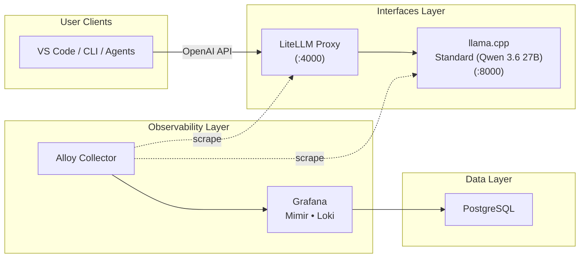

# .init

[](LICENSE)
[](docker-compose.yml)
[](README.md)
[](https://github.com/nilayparikh/spark-init/actions/workflows/lint.yml)

**A modular Docker Compose platform for local AI inference and observability on NVIDIA DGX/Spark hardware.**

`.init` is a composable, profile-driven platform that brings together data storage, full-stack observability, and OpenAI-compatible AI inference — all running locally on NVIDIA GPU hardware. Whether you're prototyping with Qwen 3.6 models or building production-grade agent infrastructure, `.init` provides the building blocks to go from zero to running in minutes.

## Features

- **Profile-driven Docker Compose** — Mix and match services with a single `COMPOSE_PROFILES` variable
- **OpenAI-compatible API proxy** — LiteLLM with multi-provider routing and authentication
- **Full observability stack** — Metrics (Mimir), logs (Loki), distributed tracing, and GPU telemetry via DCGM
- **llama.cpp inference backend** — CUDA-accelerated GGUF inference wired to the proxy
- **Standard and Lite models** — Qwen 3.6 27B (Standard) and optimized Lite variant
- **CUDA-accelerated inference** — Built for NVIDIA DGX Spark and other Blackwell/Ada hardware

## Architecture



## Stack Guide

This repository is organized as a small local platform stack composed from three main areas:

- `data/`: shared Postgres and database bootstrap.
- `observability/`: Mimir, Loki, Alloy, Grafana, and GPU telemetry.
- `interfaces/`: LiteLLM plus local llama.cpp backend.

The root compose file at `docker-compose.yml` includes the compose files from those directories, so you start the stack by selecting profiles instead of jumping between multiple compose files.

The root `.env` file is now the switchboard for that selection. Set the full active profile set in `COMPOSE_PROFILES`, then run plain root-level Compose commands.

## Profiles

| Profile              | Area             | Service(s)                                           | Notes                                                                |
| -------------------- | ---------------- | ---------------------------------------------------- | -------------------------------------------------------------------- |
| `data`               | `data/`          | `postgres`                                           | Shared dependency for LiteLLM and Grafana.                           |
| `obs`                | `observability/` | `mimir`, `loki`, `alloy`, `gpu-telemetry`, `grafana` | Observability stack. Requires `data` if Grafana should use Postgres. |
| `interface`          | `interfaces/`    | `litellm`                                            | OpenAI-compatible proxy on port `4000`.                              |
| `llama-qwen-3-6-27b` | `interfaces/`    | `llama-qwen-3-6-27b`                                 | llama.cpp Standard (Qwen 3.6 27B) backend on host port `8000`.       |

## Before You Start

1. Review `.env.example` and make sure the model paths and secrets in `.env` match your machine.
2. Set `COMPOSE_PROFILES` in `.env` to the full stack shape you want to run.
3. Ensure `LLAMA_QWEN_3_6_27B_GGUF_MODEL_PATH` points to a valid GGUF model file.

## Current Default

The checked-in `.env.example` and the current local `.env` both default to:

```text
data,obs,interface,llama-qwen-3-6-27b
```

That means the intended root workflow is:

```bash
docker compose up -d
docker compose ps
docker compose down
```

## Example Profile Sets

Set `COMPOSE_PROFILES` in `.env` to one of these shapes, then run `docker compose up -d` from the repository root.

### Full Stack — LiteLLM + llama.cpp + Observability

```bash
COMPOSE_PROFILES=data,obs,interface,llama-qwen-3-6-27b
```

### Data + Observability Only

```bash
COMPOSE_PROFILES=data,obs
```

### Interface Only (with Data)

```bash
COMPOSE_PROFILES=data,interface,llama-qwen-3-6-27b
```

## Interface Endpoints

| Surface       | Default URL                | Notes                                              |
| ------------- | -------------------------- | -------------------------------------------------- |
| LiteLLM proxy | `http://localhost:4000`    | Use `LITELLM_MASTER_KEY` when auth is required.    |
| llama.cpp     | `http://localhost:8000/v1` | Active only when `llama-qwen-3-6-27b` is selected. |

## Documentation

- `interfaces/docs/README.md`: interface architecture and profile map.
- `interfaces/docs/developer-clients.md`: operator setup for VS Code, Codex-style clients, OpenClaw, Hermes Agent, and Claude Code.
- `interfaces/docs/file-index.md`: file-by-file interface reference.
- `interfaces/docs/env-reference.md`: interface env variables.
- `data/docs/README.md`: data stack overview.
- `data/docs/file-index.md`: file-by-file data reference.
- `data/docs/env-reference.md`: data env variables.

## Editor Hygiene

The repository now includes:

- `.gitignore` entries for caches, build outputs, and local-only runtime artifacts.
- `.vscode/settings.json` exclusions for pytest caches, virtual environments, storage volumes, and other noisy folders so the explorer and search views stay focused.

## Contributing

We welcome contributions! Please read [CONTRIBUTING.md](CONTRIBUTING.md) for development guidelines, coding standards, and the pull request process.

## License

This project is licensed under the Apache 2.0 License — see the [LICENSE](LICENSE) file for details.
Copyright 2025 .init contributors
