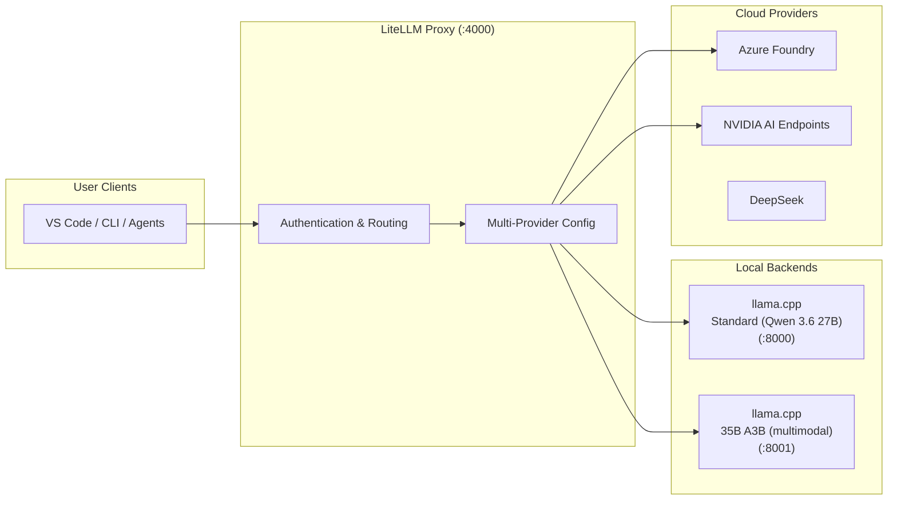

# Inference Stack

The inference layer provides OpenAI-compatible API endpoints powered by llama.cpp as the local backend runtime.

## Architecture



## Supported Models

The `.init` stack supports two local model backends:

| Model | Description | Format | Profile |
|-------|-------------|--------|---------|
| **Standard** (Qwen 3.6 27B) | Full 27B parameter model with MTP | GGUF (NVFP4) | `llama-qwen-3-6-27b` |
| **35B A3B** (Qwen 3.6 35B A3B) | Multimodal 35B A3B model with MTP and mmproj | GGUF (NVFP4) | `llama-qwen-3-6-35b-a3b` |

> **Note:** Only llama.cpp is supported as the inference backend on DGX Spark hardware due to SM120/SM121 limitations (missing TMEM, unoptimized kernels, MTP shape mismatch).

## llama.cpp Backend

The llama.cpp backend provides CUDA-accelerated inference for GGUF-quantized models.

### Build Configuration

The Dockerfile builds llama.cpp with these key settings:

- **CUDA 13.1.2** — Targets NVIDIA Blackwell/Ada GPUs
- **Architecture 12.1** — Optimized for compute capability
- **Speculative decoding with MTP** — Multi-Token Prediction for faster inference

### Runtime Configuration (27B)

The 27B backend runs with these optimized parameters:

```
--min-p 0.05
-c 131072          # Context window: 128K tokens
-b 2048            # Batch size
--parallel 1      # Parallel requests
--cont-batching
--cache-prompt
--swa-full
-t 8              # Threads
-tb 8             # Threads per batch
--mlock
--port 8080
--host 0.0.0.0
--metrics
--timeout 120
```

### Runtime Configuration (35B A3B)

The 35B A3B backend uses the same parameters as the 27B, with these differences:

```
-c 262144         # Context window: 256K tokens
-mm /models/mmproj.gguf  # Multimodal projector for vision
```

### Speculative Decoding

Both backends use speculative decoding with MTP (Multi-Token Prediction):

```
--spec-type draft-mtp,ngram-mod
--spec-draft-n-max 2
--spec-draft-p-min 0.88
--spec-draft-ngl 99
```

This allows the model to predict multiple tokens per forward pass, significantly improving throughput.

## Model Configuration

### Standard Model (Qwen 3.6 27B)

- **Format**: GGUF with NVFP4 quantization
- **Context window**: 128K tokens
- **MTP**: Multi-Token Prediction enabled for faster inference
- **VRAM requirement**: Scales with NVFP4 quantization profile

### 35B A3B Model (Qwen 3.6 35B A3B)

- **Format**: GGUF with NVFP4 quantization
- **Context window**: 256K tokens
- **Multimodal**: Supports vision via separate mmproj BF16 GGUF file
- **MTP**: Multi-Token Prediction enabled for faster inference

## LiteLLM Proxy

The LiteLLM proxy provides a unified OpenAI-compatible API surface.

### Multi-Provider Routing

```
Local DGX Spark   → DGX_SPARK_M_* / DGX_SPARK_S_* env vars
Azure Foundry     → MICROSOFT_FOUNDRY_* env vars
NVIDIA AI Endpoints → NVIDIA_* env vars
DeepSeek          → DEEPSEEK_* env vars
OpenCode Zen      → OPENCODE_ZEN_* env vars
```

### Model Naming

The proxy publishes models as `<Provider>/<Name>` identifiers. Canonical `.INIT/` aliases are configured for Claude Code model selection:

| `.INIT/` Alias | Routes To | Backend |
|----------------|-----------|---------|
| `.INIT/Ultra` | `OpenCodeZen/BIG-PICKLE` | OpenCode Zen |
| `.INIT/Pro` | `DGX/Qwen3.6-27B` | Local llama.cpp (27B) |
| `.INIT/Flash` | `DGX/Qwen3.6-35B-A3B` | Local llama.cpp (35B A3B) |

Use `/model .INIT/Pro` in Claude Code to select the local 27B backend. See [Model Reference](../../api/openai-compatible.md) for the full model catalog.

### Authentication

```
Authorization: Bearer $LITELLM_MASTER_KEY
```

## Profile Mutual Exclusivity

`llama-qwen-3-6-27b` and `llama-qwen-3-6-35b-a3b` use separate host ports (8000 and 8001 respectively) and can run simultaneously. Both require the `interface` profile for the LiteLLM proxy.

```
# Valid combinations
COMPOSE_PROFILES=data,obs,interface,llama-qwen-3-6-27b
COMPOSE_PROFILES=data,obs,interface,llama-qwen-3-6-35b-a3b
COMPOSE_PROFILES=data,obs,interface,llama-qwen-3-6-27b,llama-qwen-3-6-35b-a3b
```

## Chat Template Configuration

Qwen 3.6 models use a custom Jinja chat template mounted into the llama.cpp container:

```
./config/qwen3.6/chat_template.jinja:/workspace/chat_template.jinja:ro
```

The template is loaded with `--jinja --chat-template-file /workspace/chat_template.jinja` and enables proper reasoning format support (`--reasoning on --reasoning-format deepseek`).
