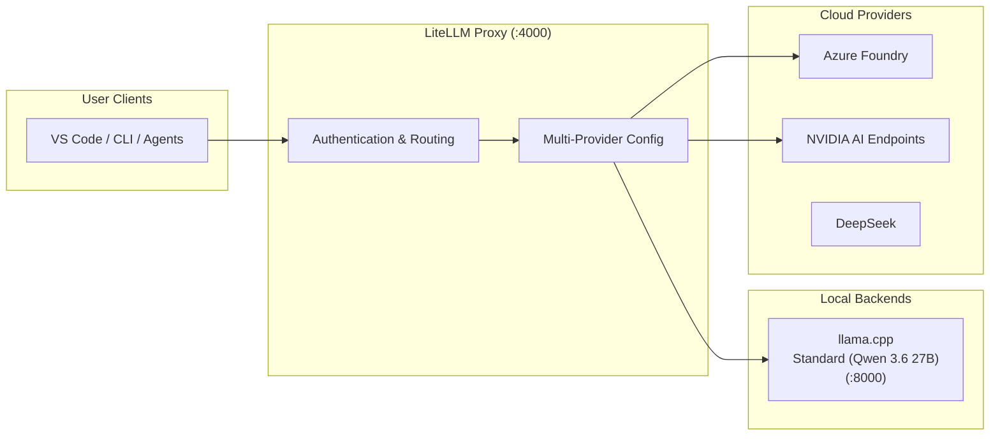

# Inference Stack

The inference layer provides OpenAI-compatible API endpoints powered by llama.cpp as the local backend runtime.

## Architecture



## Supported Models

The `.init` stack supports two model variants:

| Model                       | Description                                | Format        | Profile                |
| --------------------------- | ------------------------------------------ | ------------- | ---------------------- |
| **Standard** (Qwen 3.6 27B) | Full 27B parameter model with MTP          | GGUF (Q4_K_M) | `llama-qwen-3-6-27b`   |
| **Lite**                    | Optimized variant for lower resource usage | GGUF (Q4_K_M) | `llama-lite` (planned) |

> **Note:** vLLM is NOT supported on DGX Spark hardware due to SM120/SM121 limitations (missing TMEM, unoptimized kernels, MTP shape mismatch). Only llama.cpp provides stable inference.

## llama.cpp Backend

The llama.cpp backend provides CUDA-accelerated inference for GGUF-quantized models.

### Build Configuration

The Dockerfile builds llama.cpp with these key settings:

- **CUDA 13.1.2** — Targets NVIDIA Blackwell/Ada GPUs
- **Architecture 12.1** — Optimized for compute capability
- **Speculative decoding with MTP** — Multi-Token Prediction for faster inference

### Runtime Configuration

The backend runs with these optimized parameters:

```
--temp 0.15
--top-p 0.92
--top-k 10
--presence-penalty 0.0
--frequency-penalty 1.03
--min-p 0.05
-c 262144          # Context window: 262K tokens
-b 2048           # Batch size
--parallel 2     # Parallel requests
--cont-batching
```

### Speculative Decoding

The backend uses speculative decoding with MTP (Multi-Token Prediction):

```
--spec-type draft-mtp,ngram-mod
--spec-draft-n-max 3
--spec-draft-p-min 0.90
--spec-draft-ngl 99
```

This allows the model to predict multiple tokens per forward pass, significantly improving throughput.

## Model Configuration

### Standard Model (Qwen 3.6 27B)

- **Format**: GGUF with Q4_K_M quantization
- **Context window**: 262K tokens
- **MTP**: Multi-Token Prediction enabled for faster inference
- **VRAM requirement**: ~30GB for Q4_K_M quantization

### Lite Model

- **Format**: GGUF with Q4_K_M quantization
- **Optimized for**: Lower VRAM and CPU resource usage
- **Use case**: Development and testing environments

## LiteLLM Proxy

The LiteLLM proxy provides a unified OpenAI-compatible API surface.

### Multi-Provider Routing

```
Azure Foundry → AZURE_ORCHESTRATOR_
NVIDIA AI Endpoints → NVIDIA_
DeepSeek → DEEPSEEK_
Local backends → INTERFACE_
```

### Model Naming Conventions

- `openai/<provider>/...` — Standard OpenAI-compatible naming
- `anthropic/<provider>/...` — Claude compatibility aliases:
  - `claude-opus-4.7`
  - `claude-sonnet-3.5
  - `claude-haiku-3.5

### Authentication

```
Authorization: Bearer $LITELLM_MASTER_KEY
```

## Profile Mutual Exclusivity

`llama-qwen-3-6-27b` and `vllm-qwen-3-6-27b` are **mutually exclusive** — both use host port 8000. The operator must choose one backend per stack instance.

```
# Valid combinations
COMPOSE_PROFILES=data,obs,interface,llama-qwen-3-6-27b
COMPOSE_PROFILES=data,interface,vllm-qwen-3-6-27b
COMPOSE_PROFILES=data,vllm-qwen-3-6-35b-a3b

# Invalid — port 8000 conflict
COMPOSE_PROFILES=data,interface,llama-qwen-3-6-27b,vllm-qwen-3-6-27b
```

## Chat Template Configuration

Qwen 3.6 models use a custom Jinja chat template mounted into the container:

```
./config/qwen3.6/chat_template.jinja:/workspace/chat_template.jinja:ro
```

The template is loaded with `--jinja --chat-template-file /workspace/chat_template.jinja` and enables proper reasoning format support (`--reasoning on --reasoning-format deepseek`).35B_A
