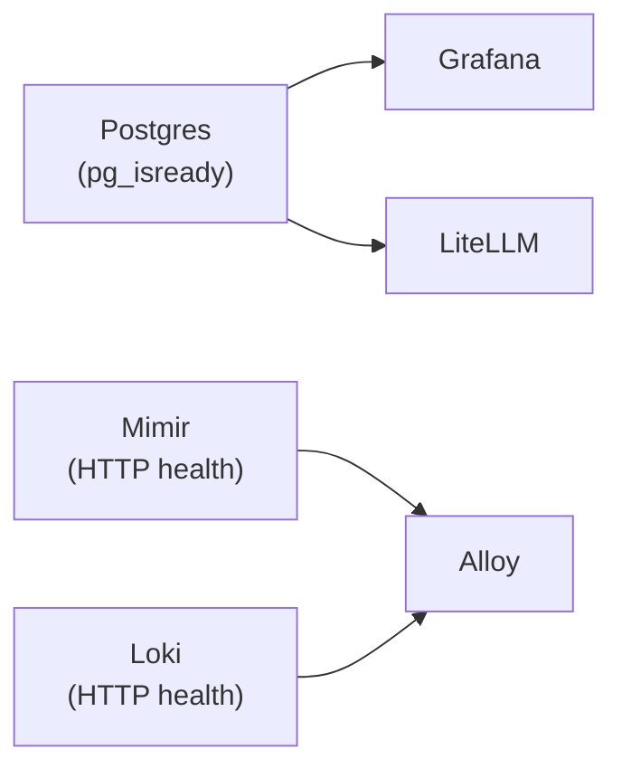

# Networking

All services in the `.init` stack communicate over a shared Docker network. This page documents the networking architecture, service discovery, and port mapping strategy.

## External Network Architecture

The stack uses an **external Docker network** named `init_default`. The root `docker-compose.yml` declares it as external:

```yaml
networks:
  default:
    external: true
    name: init_default
```

### Why External?

An external network enables cross-compose-file service discovery. Because the stack is split across multiple compose files (`data/`, `observability/`, `interfaces/`), an external network ensures all services can resolve each other by container name regardless of which compose file defines them.

### Creating the Network

Before starting the stack, create the external network:

```bash
docker network create init_default
```

## Service Discovery

Services discover each other via Docker's embedded DNS. Container names serve as hostnames within the `init_default` network.

| Service         | Internal Hostname | Port (internal)              | Accessed By              |
|-----------------|-------------------|------------------------------|--------------------------|
| `postgres`      | `postgres`        | 5432                         | Grafana, LiteLLM         |
| `mimir`         | `mimir`           | 9009 (Prometheus), 8080 (HTTP) | Alloy, Grafana        |
| `loki`          | `loki`            | 3100 (HTTP)                  | Alloy, Grafana           |
| `alloy`         | `alloy`           | 12345 (scrape)               | Internal only            |
| `gpu-telemetry` | `gpu-telemetry`   | 9400 (metrics)               | Alloy                    |
| `cadvisor`      | `cadvisor`        | 8080 (metrics)               | Alloy                    |

## host.docker.internal

Inference backends (llama.cpp) run on **host ports** and are accessed via `host.docker.internal`. This special hostname resolves to the host's IP address from within Docker containers.

```yaml
# LiteLLM needs to reach llama.cpp on the host
extra_hosts:
  - host.docker.internal:host-gateway

environment:
  QWEN3_6_27B_BASE_URL: http://host.docker.internal:8000/v1
```

### Why Host Ports for Inference?

llama.cpp requires direct GPU access via the NVIDIA runtime. Running on host ports ensures:

- **GPU passthrough works correctly** — the NVIDIA runtime maps directly to host GPUs
- **Model files are mounted from the host** — large GGUF files (40+ GB) are accessed via bind mounts
- **Performance is optimal** — no network overhead between LiteLLM and the inference backend

## Port Mapping Strategy

| Host Port | Service | Profile | Notes |
| --------- | ------- | ------- | ----- |
| 3000      | Grafana | `obs`   |

Dashboard UI. Default login: admin / local_observability_admin.
| 4000 | LiteLLM proxy | `interface`
OpenAI-compatible API. Requires `LITELLM_MASTER_KEY`.
| 5432 | PostgreSQL | `data`
Shared platform database. Not exposed to external hosts.
| 8000 | llama.cpp backend | `llama-qwen-3-6-27b`
Direct inference endpoint.

## Compose File Includes

The root `docker-compose.yml` uses native Docker Compose `include` directives to pull in layer-specific compose files:

```yaml
include:
  - ./data/docker-compose.data.yml
  - ./observability/docker-compose.obs.yml
  - ./interfaces/docker-compose.interface.yml
  - ./network/docker-compose.yaml
```

Each included file defines services that join the `init_default` network automatically.

## Health Check Dependencies

Services enforce deterministic boot ordering via `depends_on` with `condition: service_healthy`:



- **Postgres** uses `pg_isready` to confirm it accepts connections
- **Mimir and Loki** export explicit HTTP health status endpoints
- **Alloy** never starts until Mimir and Loki are healthy — preventing streams to uninitialized endpoints

## Manual Startup Only

Every service sets `restart: "no"` explicitly. The stack **never auto-starts** when the Docker daemon or host boots. Operators must manually invoke `docker compose up -d` for any services they want running.

This design ensures:

- GPU resources are not consumed when inference is not needed
- Model files are only loaded when explicitly requested
- Operators have full control over which profiles are active
