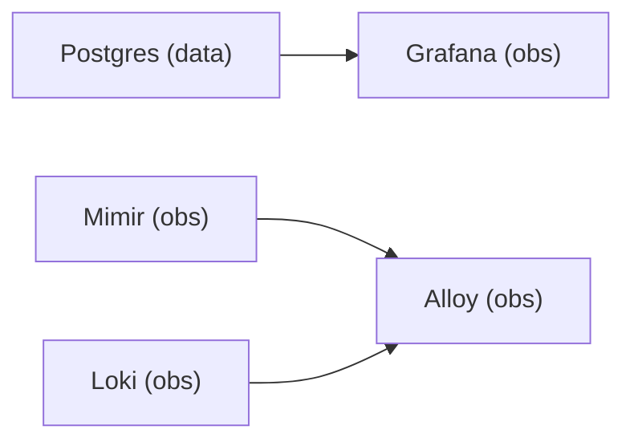

# Observability Stack

The observability layer collects, stores, and visualizes telemetry from the entire `.init` platform.

## Components

| Service         | Purpose                                                 | Profile |
| --------------- | ------------------------------------------------------- | ------- |
| `alloy`         | Host metrics and log collector (Grafana Alloy)          | `obs`   |
| `mimir`         | Local metrics backend, single-binary, filesystem-backed | `obs`   |
| `loki`          | Local log backend, single-binary, filesystem-backed     | `obs`   |
| `cadvisor`      | Docker container telemetry collector                    | `obs`   |
| `gpu-telemetry` | NVIDIA DCGM exporter for GPU telemetry                  | `obs`   |
| `grafana`       | UI and dashboard layer                                  | `obs`   |

## Collection Strategy

### Host Telemetry

Alloy pulls host system metrics (CPU, memory, disk) via its `prometheus.exporter.unix` collector on a 10-second loop.

### Container Telemetry

cAdvisor collects Docker container metrics every 15 seconds. Interface-specific endpoint scrapes are gated by Docker container discovery so inactive profiles do not produce dead scrape targets or mislabel whichever runtime currently owns a shared host port.

### GPU Telemetry

NVIDIA DCGM exporter collects GPU metrics every 5 seconds. Metrics include:

- GPU utilization and memory usage
- Thermal readings and power consumption
- ECC error counts and memory copy utilization

### llama.cpp Runtime Telemetry

The native `/metrics` endpoint plus a lightweight exporter surfaces:

- Request throughput and latency
- Token generation rates
- Slot state (`/slots`) — active, idle, loading, context sizes
- Props metadata (`/props`) — model info, quantization format

### System and NVIDIA Events

Systemd journal is the primary Linux log surface. Journal logs are enriched with normalized `log_domain`, `log_category`, and `vendor` labels so dashboards can split kernel and NVIDIA activity from service and container activity.

## Design Decisions

- **Metrics and logs share the same host, role, environment, and stack labels** — consistent labeling across all collectors
- **`job` names are normalized for dashboards** — raw collector names are abstracted away
- **Interface providers keep their native exporter metrics when available**, but also emit normalized `llm_provider_*` metrics so Grafana can use one dashboard shape across runtimes
- **Journal is the primary Linux log surface** — avoids relying on rotating text files for kernel and system service events
- **File tails are restricted to platform maintenance logs** — avoids duplicate ingestion from syslog-style files already present in the journal

## Dashboard Provisioning

Grafana provisions four machine dashboards from file:

1. **Overview** — High-level system and GPU health
2. **Detailed Host Signals** — CPU, memory, disk, network
3. **Dedicated Logs** — System and container log exploration
4. **Docker Container Telemetry** — Per-container resource usage

Grafana also provisions:

- A dedicated container log dashboard for Docker stdout and stderr streams with compose project, profile, service, and container filters
- A provider-agnostic interface dashboard for runtime request and token telemetry

Alert rules are provisioned from file so thermal, filesystem, and host saturation checks stay versioned with the rest of the stack.

## Boot Order

- **Postgres** must start before Grafana (`depends_on` with `condition: service_healthy`)
- **Mimir, Loki, DCGM exporter, and cAdvisor** must start before Alloy (`depends_on` with `condition: service_started`)
- **Alloy** never attempts to stream scraped data to uninitialized endpoints

## Storage

All observability data persists locally:

- Mimir blocks: `data/storage/mimir/` (mounted as `/var/lib/mimir`)
- Loki chunks and WAL: `data/storage/loki/` (mounted as `/var/lib/loki`)
- Alloy state: `observability/volumes/alloy/` (mounted as `/var/lib/alloy`)
- Grafana data: `observability/volumes/grafana/` (mounted as `/var/lib/grafana`)
- Grafana dashboards and provisioning configs are versioned in `observability/config/grafana/provisioning/`
