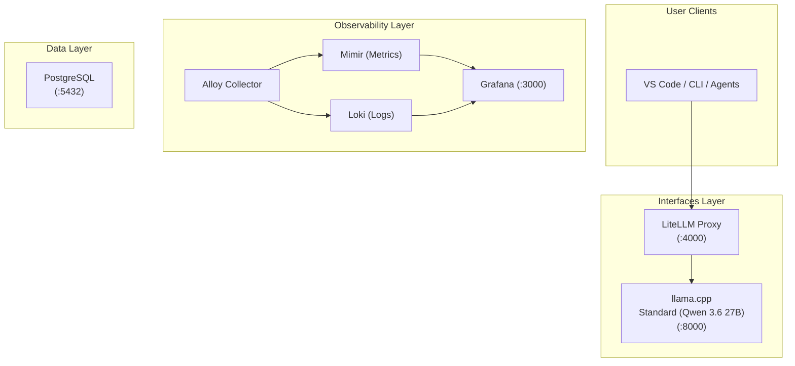
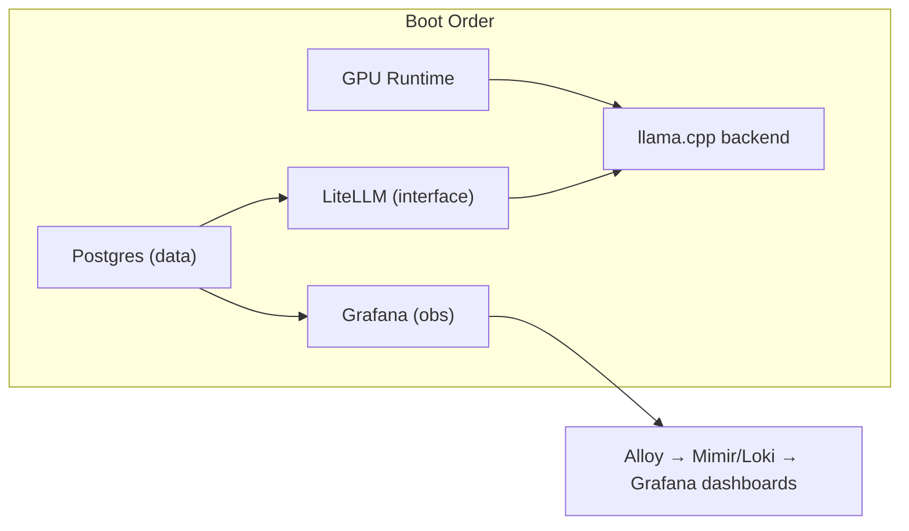

# Architecture Overview

The `.init` stack is organized as a three-layer platform, each layer independently composable through Docker Compose profiles.

## Three-Layer Design



### Data Layer (`data/`)

The foundation of the stack. Provides shared PostgreSQL for all services that need persistent storage.

| Service    | Purpose                                                      | Port |
| ---------- | ------------------------------------------------------------ | ---- |
| `postgres` | Shared platform database with multi-tenant bootstrap scripts | 5432 |

PostgreSQL serves two primary consumers:

- **Grafana** — Uses its own database and user (`grafana/grafana_local_obsv`) for dashboard and data source configuration.
- **LiteLLM** — Uses its own database and user (`litellm_interface/litellm_interface_local`) for request logging, usage tracking, and provider configuration.

### Observability Layer (`observability/`)

Collects, stores, and visualizes telemetry from the entire stack.

| Service         | Purpose                                                 |
| --------------- | ------------------------------------------------------- |
| `alloy`         | Host metrics and log collector (Grafana Alloy)          |
| `mimir`         | Local metrics backend, single-binary, filesystem-backed |
| `loki`          | Local log backend, single-binary, filesystem-backed     |
| `cadvisor`      | Docker container telemetry collector                    |
| `gpu-telemetry` | NVIDIA DCGM exporter for GPU telemetry                  |
| `grafana`       | UI and dashboard layer                                  |

### Interfaces Layer (`interfaces/`)

The AI inference surface. Provides OpenAI-compatible API endpoints powered by llama.cpp.

| Service              | Purpose                                             | Port |
| -------------------- | --------------------------------------------------- | ---- |
| `litellm`            | OpenAI-compatible proxy with multi-provider routing | 4000 |
| `llama-qwen-3-6-27b` | Standard (Qwen 3.6 27B) backend via llama.cpp       | 8000 |

## Profile Selection Logic

The stack uses Docker Compose profiles to control which services start. The `COMPOSE_PROFILES` variable in `.env` is the single switchboard for the entire platform.

```
COMPOSE_PROFILES=data,obs,interface,llama-qwen-3-6-27b
```

Each service declares which profiles it belongs to. Docker Compose starts only services matching at least one active profile.

### Profile Dependency Rules

| Rule                                               | Enforcement                                  |
| -------------------------------------------------- | -------------------------------------------- |
| `interface` requires `data` (Postgres for LiteLLM) | Manual — operator must include both profiles |
| `obs` requires `data` (Postgres for Grafana)       | Manual — operator must include both profiles |
| `llama-qwen-3-6-27b` is independent of `obs`       | Can run with or without observability        |

## Service Dependency Graph



- **Postgres** must start before Grafana and LiteLLM (enforced via `depends_on` with `condition: service_healthy`).
- **GPU backends** are independent of Postgres — they only need the NVIDIA runtime and model files.
- **Alloy** must start after Mimir and Loki are healthy (enforced via `depends_on` with `condition: service_healthy`).

## Data Flow

1. User sends a request to `http://localhost:4000/v1/chat/completions`
2. LiteLLM proxy authenticates the request and routes to the appropriate backend
3. Backend (llama.cpp) processes the request on GPU
4. Response flows back through LiteLLM to the user
5. Throughout this flow, Alloy collects metrics from all services and streams them to Mimir/Loki for Grafana visualization

## Networking

All services communicate over a shared Docker network `init_default` (external network). This allows:

- Cross-compose-file service discovery (services in `data/` are visible to `interfaces/`)
- `host.docker.internal` for backends that must be accessed from the host (llama.cpp on host ports)

See [Networking](networking.md) for details.
