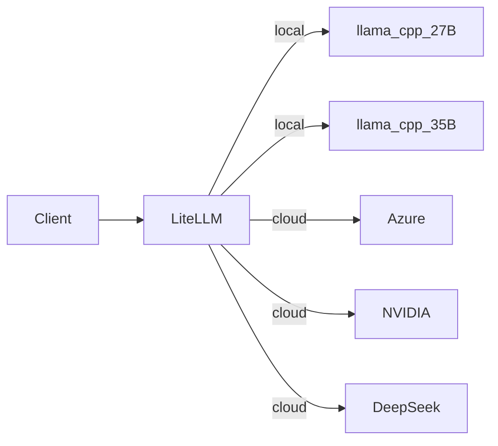

# Interfaces Layer — Inference

The AI inference surface of the `.init` stack, purpose-built for NVIDIA DGX Spark (GB10, SM120/SM121).

## What This Layer Does

Two things:
1. **LiteLLM proxy** (`:4000`) — API gateway that handles auth, model routing, and usage logging
2. **llama.cpp backends** (`:8000` / `:8001`) — GPU inference containers for Qwen 3.6 models

Clients talk to LiteLLM. LiteLLM routes to the right backend (local or cloud). llama.cpp runs the model on your GPU.



## DGX Spark First

Everything here is tuned for DGX Spark's specific hardware:

| Constraint | How We Handle It |
|---|---|
| **SM120/SM121 compute** | llama.cpp only (no vLLM — see below) |
| **128 GB unified memory** | Models sized to fit with room to spare |
| **GB10 ARM64 CPU** | All binaries built for `linux/arm64` |
| **No TMEM** | GGUF format loads weights directly — no hardware Tensor Memory required |
| **Driver 580.x** | Compatible with CUDA 13.1.2, no forced upgrade |

### Why Not vLLM?

vLLM's NVFP4 kernels require TMEM (server-class SM100) and driver ≥ 595. DGX Spark has neither. Attempting to run vLLM NVFP4 on SM120 causes:

- **Illegal instruction crashes** — Cutlass/FlashInfer backends invoke server-class instructions
- **7 GB VRAM waste** — NVFP4's block-packed layout falls back to unoptimized software paths
- **MTP failures** — speculative decoding head fails to inherit quantization layout

**llama.cpp avoids all of this** because GGUF loads weights directly into GPU memory without layout transformations. No TMEM dependency, no kernel fallbacks.

## Models

| Alias | Model | Params | Context | Port | File |
|---|---|---|---|---|---|
| `.INIT/Pro` | Qwen 3.6 27B | 27B | 128K | `:8000` | `qwen3.6-27b-text-nvfp4-mtp.gguf` (~14 GB) |
| `.INIT/Flash` | Qwen 3.6 35B A3B | 35B (3.5B active) | 256K | `:8001` | `qwen3.6-35b-a3b-nvfp4-mtp.gguf` (~22 GB) |

Both use **NVFP4 quantization** (NVIDIA ModelOpt, group_size=16) with **MTP speculative decoding**. This combination gives:

- **~40 tok/s** (27B) / **~30 tok/s** (35B) on a single DGX Spark
- **~58 GB / ~80 GB** memory usage — leaves headroom for additional processes
- **BF16 MTP head** preserved for full speculative decoding accuracy

See `docs/capabilities.md` for the `.INIT/` alias model and all available model IDs.

## Files

| Path | Purpose |
|---|---|
| `docker-compose.interface.yml` | Service definitions (all flags documented inline) |
| `config/litellm/config.yaml` | Root LiteLLM routing — includes, aliases, retry policy |
| `config/litellm/providers/dgx-spark.yaml` | Local DGX model routing (27B + 35B A3B) |
| `config/litellm/providers/azure-foundry.yaml` | Azure Foundry cloud models |
| `config/litellm/providers/deepseek.yaml` | DeepSeek native API |
| `config/litellm/providers/nvidia.yaml` | NVIDIA AI Endpoints |
| `config/litellm/providers/opencode-zen.yaml` | OpenCode Zen models |
| `config/qwen3.6/chat_template.jinja` | Jinja2 template (Qwen 3.6 reasoning format) |
| `dockerfiles/Dockerfile` | llama.cpp CUDA build for Blackwell aarch64 |
| `interface.md` | Legacy quick reference (kept for compatibility) |

## Depends On

- `../data/` — Postgres for LiteLLM spend logging
- `../network/` — requires `init_default` network

## Model Routing

The `.INIT/` aliases (`.INIT/Pro`, `.INIT/Flash`, `.INIT/Ultra`) are defined in `config.yaml` under `model_group_alias`. They map to specific provider model IDs and are discoverable by Claude Code through gateway model discovery.

```yaml
model_group_alias:
  ".INIT/Pro": "DGX/Qwen3.6-27B"
  ".INIT/Flash": "DGX/Qwen3.6-35B-A3B"
  ".INIT/Ultra": "OpenCodeZen/BIG-PICKLE"
```
