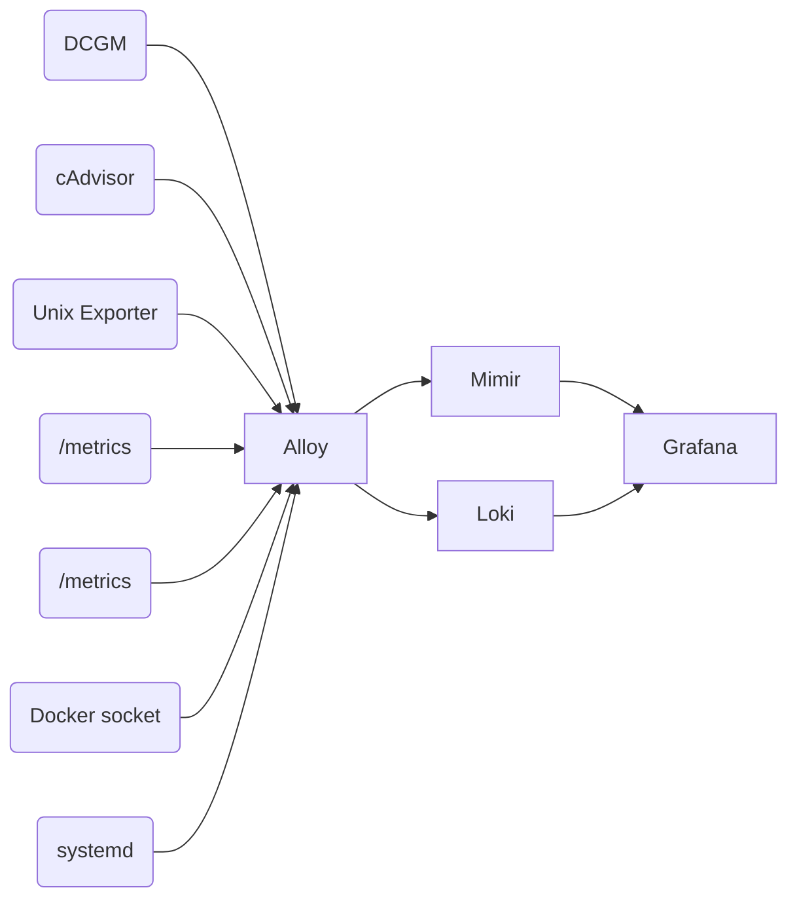

# Observability Layer — Monitoring

Auto-collected telemetry for the `.init` stack on DGX Spark.

## What This Layer Does

Metrics and logs flow in one direction:

**Grafana on `:3000`** — that's the interface. Everything else is automatic.

## DGX Spark Context

The observability stack is tuned for a single-node DGX Spark workstation:

| Capability | How It Works |
|---|---|
| **GPU monitoring** | DCGM exporter reports utilization, memory, thermals, power every 5s |
| **Inference metrics** | llama.cpp's `/metrics` + `/slots` endpoints surface token throughput, queue depth, slot state |
| **Container health** | cAdvisor tracks CPU, memory, network per Docker container |
| **Host telemetry** | Alloy's Unix exporter collects CPU, memory, disk from the Grace CPU |
| **Log aggregation** | Alloy tails Docker stdout + systemd journal; ships to Loki |
| **Dashboards** | Pre-provisioned: machine overview, GPU signals, container logs, interface provider metrics |

**All of this runs locally on the DGX Spark.** No cloud dependency for observability. Data stays on your machine.

## Services

| Service | Image | Port | Purpose |
|---|---|---|---|
| **Mimir** | `grafana/mimir:latest` | `:9009` | Prometheus-compatible metrics storage (7d retention) |
| **Loki** | `grafana/loki:latest` | `:3100` | Log aggregation storage (2d retention) |
| **Alloy** | `grafana/alloy:latest` | — | Central collector — scrapes, relabels, forwards |
| **GPU Telemetry** | `nvcr.io/nvidia/k8s/dcgm-exporter` | `:9400` | NVIDIA DCGM metrics exporter |
| **cAdvisor** | `gcr.io/cadvisor/cadvisor:v0.52.1` | — | Container resource metrics |
| **Grafana** | `grafana/grafana-oss:latest` | `:3000` | Dashboard UI |

Auto-discovery: Alloy discovers LiteLLM and llama.cpp through the Docker socket. Add a new inference backend and its metrics appear automatically — no config change needed.

## Files

| Path | Purpose |
|---|---|
| `docker-compose.obs.yml` | All service definitions (documented inline) |
| `config/config.alloy` | HCL pipeline — scrape configs + label conventions |
| `config/loki-config.yaml` | Loki single-binary storage config |
| `config/mimir-config.yaml` | Mimir single-binary storage config |
| `config/grafana/provisioning/datasources/` | Mimir + Loki data source definitions |
| `config/grafana/provisioning/dashboards/machine/` | 7 JSON dashboards |
| `config/grafana/provisioning/alerting/machine-alerts.yaml` | Alert rules |
| `volumes/` | Runtime data (git-ignored) |

## Dashboard Quick Reference

| Dashboard | What It Shows |
|---|---|
| **Spark Machine Overview** | GPU thermals, disk capacity, system health at a glance |
| **Spark Machine Signals** | Detailed CPU, memory, disk, network, GPU signals |
| **Spark Docker Containers** | Per-container CPU, memory, network, throttling |
| **Spark Container Logs** | Docker stdout/stderr with compose project/service filters |
| **Spark Interface Providers** | Token throughput, request pressure, slot state |
| **Spark Machine Logs** | Kernel, NVIDIA, service events from systemd journal |
| **Spark vLLM** | vLLM metrics (only if vLLM profile is active) |

## Depends On

- `../data/` — Postgres for Grafana dashboards and users
- `../network/` — requires `init_default` network
